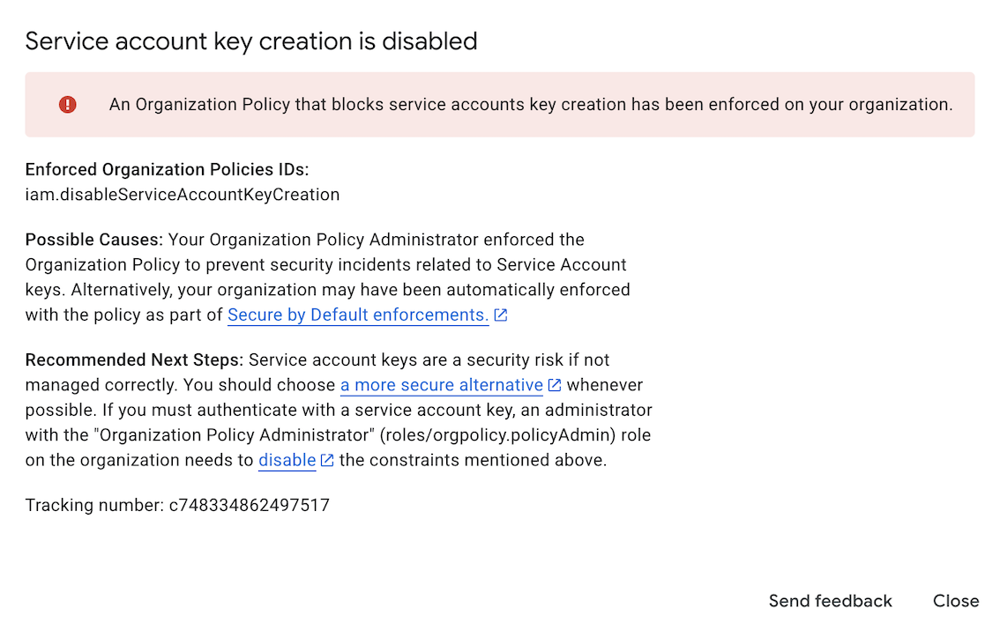
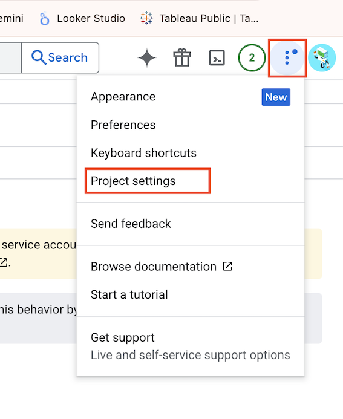
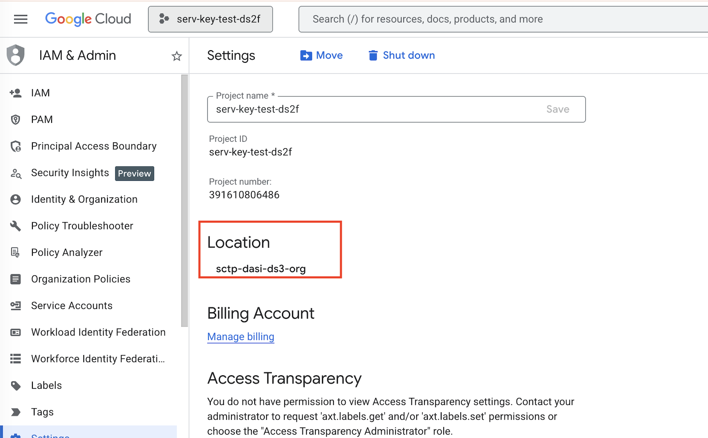
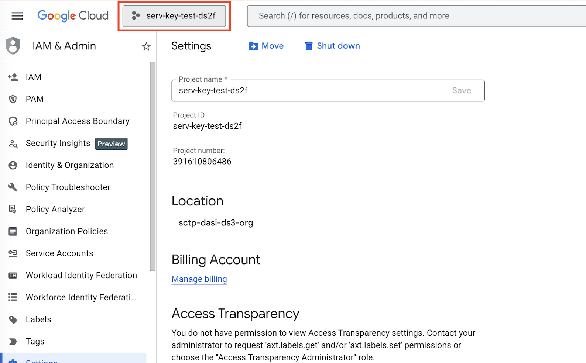
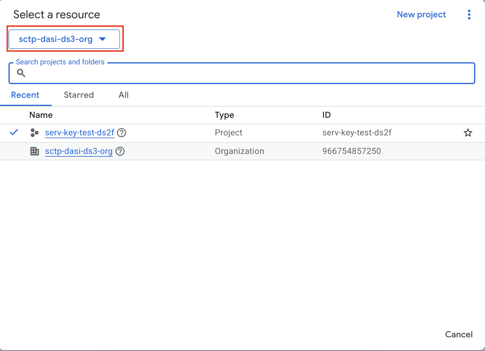
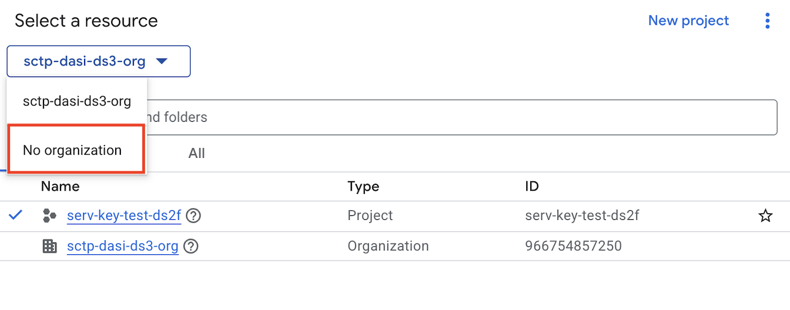
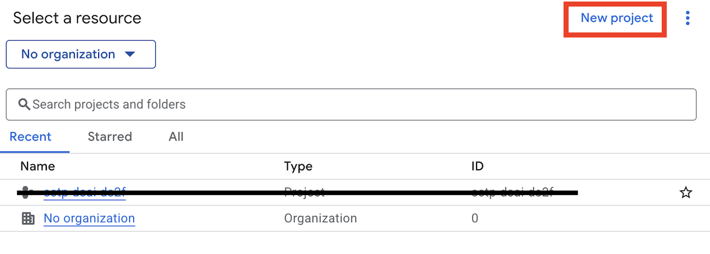
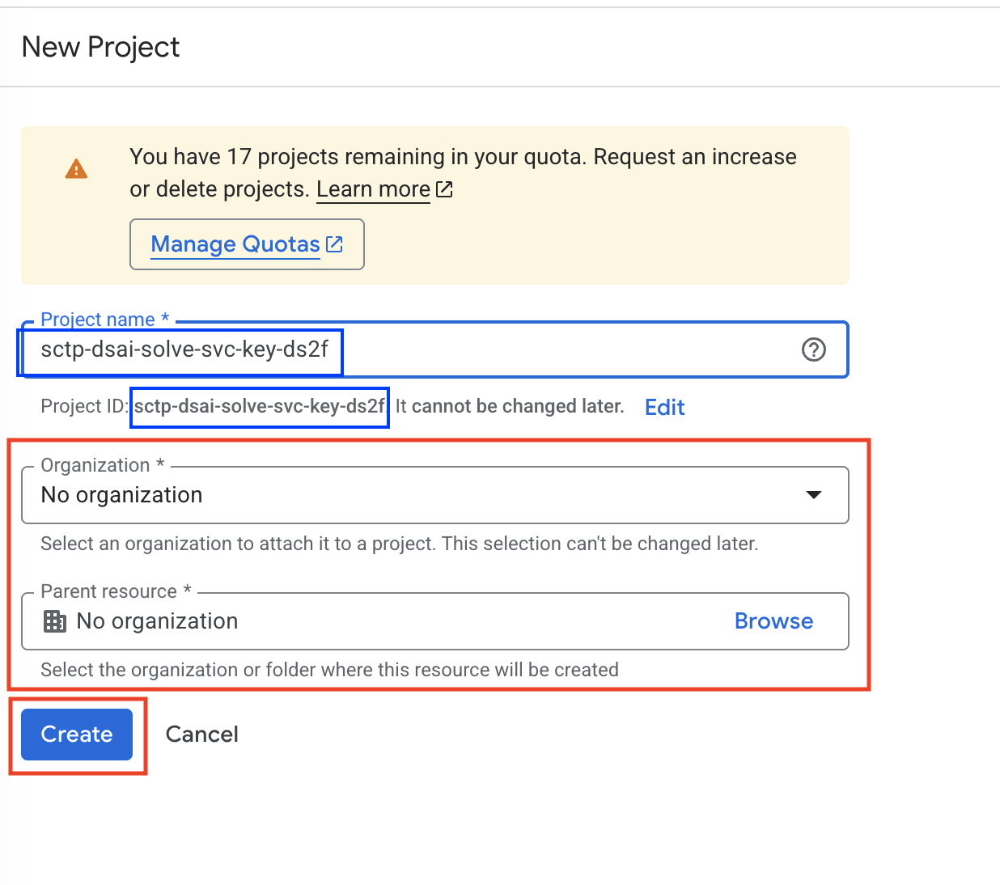
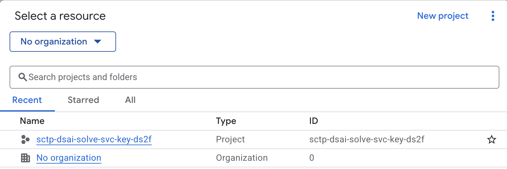
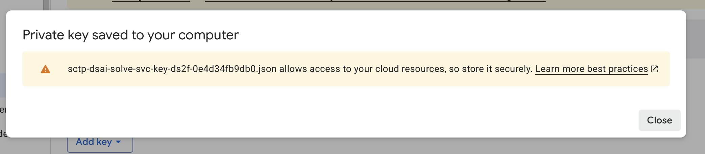

# GCP Service Account Key Creation Disabled

This document is to address `Service Account Key Creation Disabled` issue. Sometime in February, Google decided to set deny service key creation as the default policy.

If we follows the setup guide [here](https://drive.google.com/file/d/1UlqE8E9si7ATKmj0mJn4zj4NMvOQODXa/view?usp=sharing), some of us might get this problem. Please note that as Google is progressively propagate this policy not all of us will be affected.

During service account key creation, affected users will get the following error message.




Once we encounter this issue, we need to check our project settings. To go to project settings, click the 3 dot on the top right corner and select `Project settings`



On the project settings, notice the location which is under an organization. (See image below). This is how Google propagate this policy.



To get around this limitation, there is 2 options:
- Create a new project under `No Organization`
- Give ourselves proper credential to disable this policy

## Option 1: Create a new project under `no organization`

First click on the project selection option as shown below:



We should see the screen similar to below:



Click on the top left organization and select `No organization`:



After that you should see something similar but no projects created. 



Click `New project` on the top right corner.



Select a project name that is unique so that the id is the same as project name. Most important make sure that under `Organization` we have no organization.

Once the project is created, it should be similar as below



Next, refer to the setup guide [here](https://drive.google.com/file/d/1UlqE8E9si7ATKmj0mJn4zj4NMvOQODXa/view?usp=sharing) and repeat step 3 to step 5.

Once your service is created you should see something similar.



After service key is downloaded, we need to re-configure our CLI (command line interface). You need to execute both instructions.

For Windows WSL user:

```bash
gcloud init
```

follow by:

```bash
gcloud auth application-default login
```

For Mac users:

```bash
# Try
gcloud init

# If not working try
./google-cloud-sdk/bin/gcloud init
```

follow by:

```bash
# Try
gcloud auth application-default login

# If not working try
./google-cloud-sdk/bin/gcloud auth application-default login
```

> To test out if your connection is good, you can re-run lesson 2.2 under Google Cloud Storage. (DO NOT USE Anonymous Client).

> If you still encounter error such as `billing account not enabled`, please add a credit card to the account and link to the appropriate project.


## Option 2: Override the Disable Service Key Creation Policy

pending....
